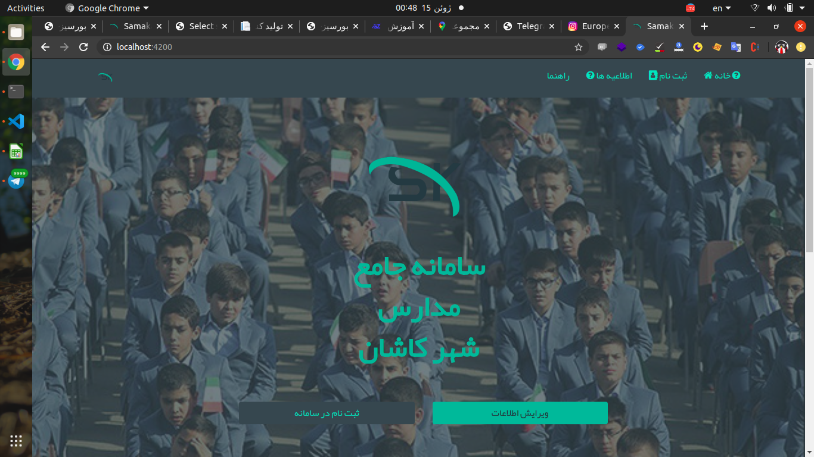
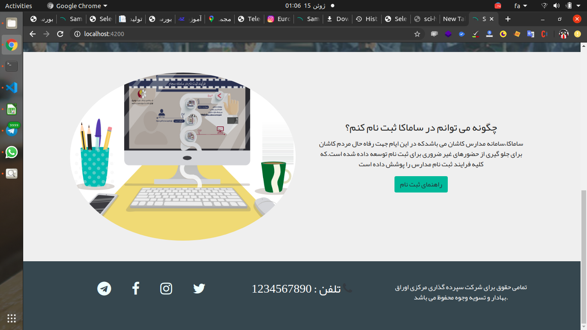
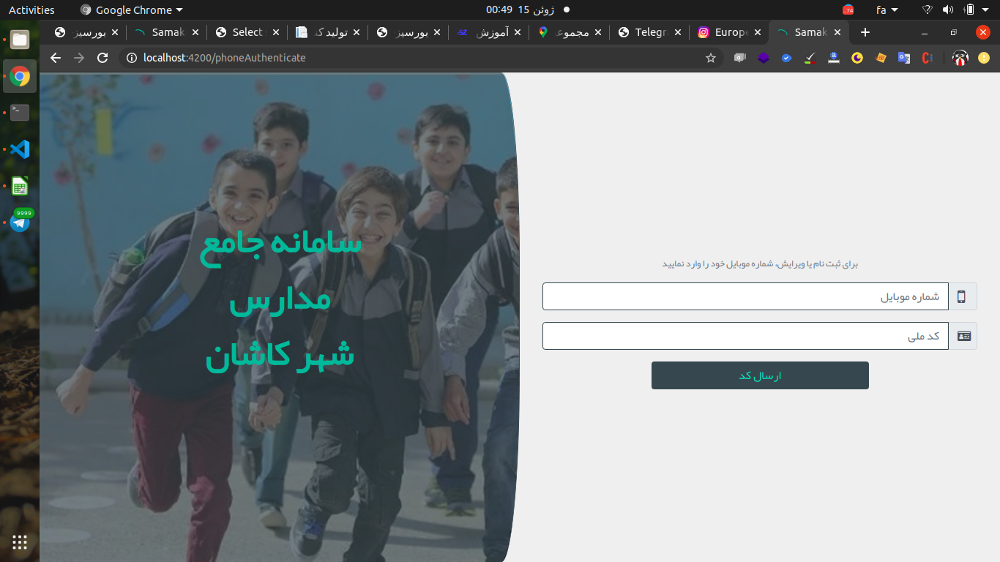
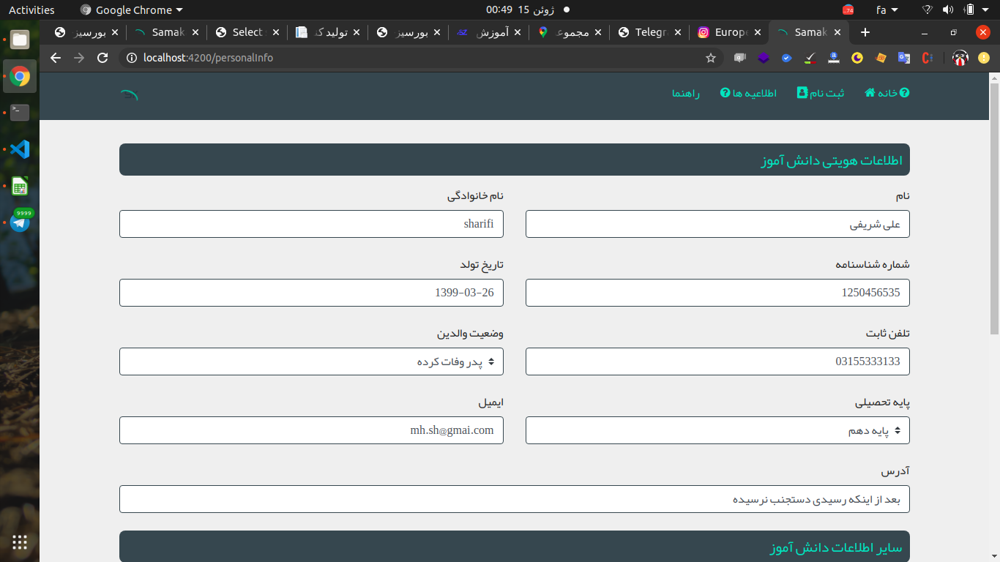
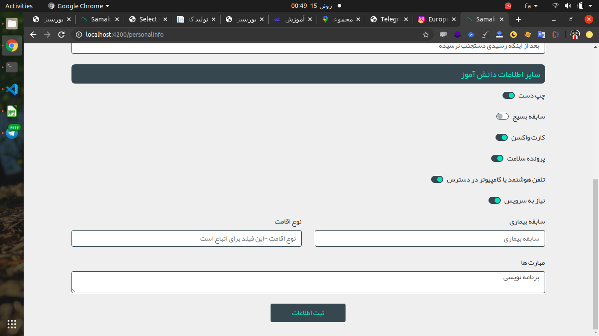
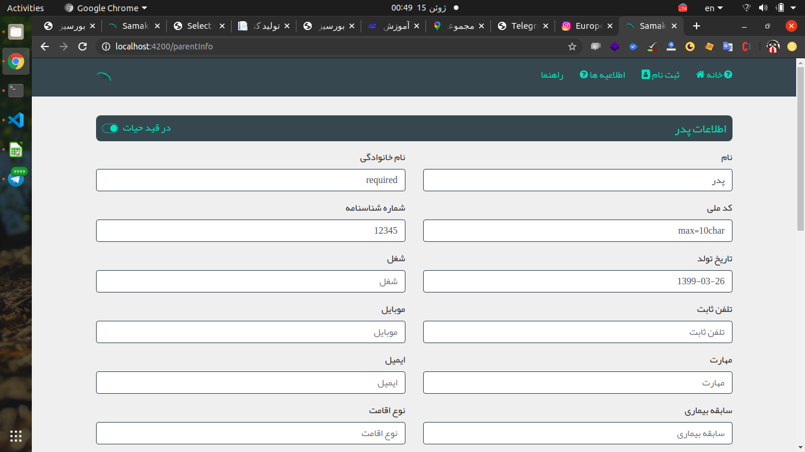
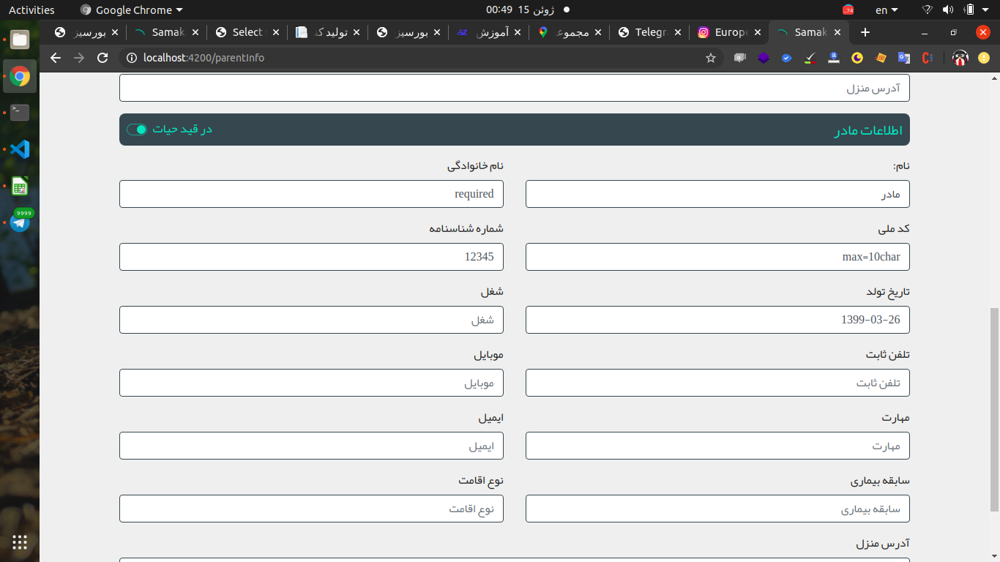
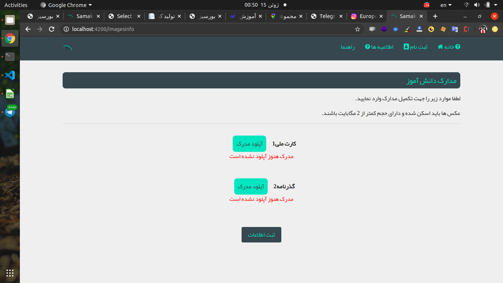
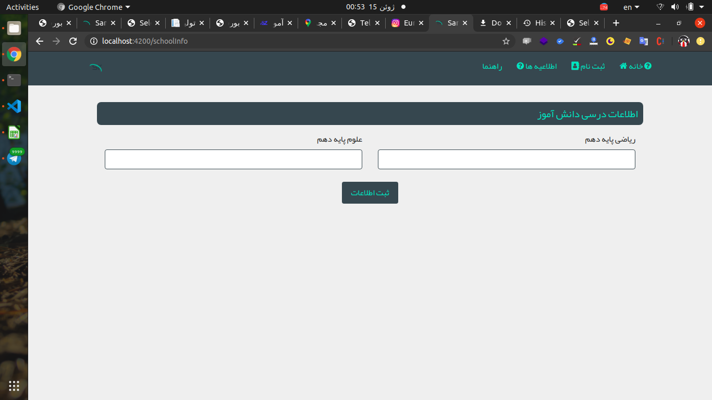

# ساماکا-سامانه مدارس کاشان
با توجه به شیوع کرونا جمعی از بچه های برنامه نویس دور هم جمع شدیم و در کوتاه ترین زمان ممکن یک سامانه ای توسعه داده شد که افراد بتوانند پیش ثبت نام اولیه خود را در مدرسه به صورت انلاین انجام داده و سپس بعد از تایید به مدرسه مراجعه کرده تا از کاغذ بازی های اضافه پرهیز شود.

## ویژگی های ساماکا
* عضویت و ورود به سیستم به وسیله رمز یکبار مصرف(پیامک)
* دریافت کلیه اطلاعات مورد نیاز از دانش اموز
* دریافت اطلاعات پدر و مادر دانش اموز
* اپلود تصاویر مورد نیاز از قبیل عکس سه در چهار،شناسنامه و...
* دریافت نمره های مورد نیاز برای هر پایه
* و....

### تکنولوژی مورد استفاده
* Backend : django  
* FrontEnd : Angular9
  
### نکته:
کلیه اطلاعات فرم ها بر اساس اطلاعات مورد نیاز آموزش و پروش توسعه داده شده است.  
---
# تصاویری از محیط ساماکا

## صفحه اصلی

  
  
---
## صفحه ثبت نام و لاگین
ثبت نام و ورود به وسیله کد ملی و شماره همراه صورت میگیرد.  
که برای شخص یک کد فعال سازی ارسال میگردد  

  
---
## صفحه اطلاعات دانش آموز

  
  
---
## اطلاعات خانواده دانش آموز

### اطلاعات سرپرست/پدر  
دریافت اطلاعات پدر و مادر به صورت جداگانه  
  
### اطلاعات مادر 
  
---
## دریافت تصاویر مورد نیاز

---

## نمرات مورد نیاز
درصورتی که هرپایه نیاز به نمرات خاصی دارد در اینجا میتوان از دانش آموز دریافت نمود.  

----

